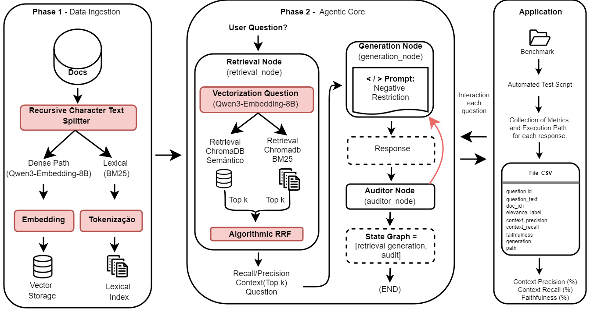

# Agent-Oriented Model for Hybrid Retrieval and Auditing of Long Texts

This project presents an agent-based architecture for RAG (Retrieval-Augmented Generation) systems, focused on hybrid retrieval and factual auditing of long texts[cite: 2]. The goal is to generate responses that are strictly verifiable and grounded in context, mitigating issues such as the *lost in the middle* phenomenon and hallucinations, especially in technical and complex domains[cite: 2].

## 🏗 System Architecture

*Fig 1. General workflow of the proposed architecture, encompassing data ingestion, the agentic core, and the application.*

The system's workflow is divided into three main phases[cite: 2]:

* **Phase 1: Data Ingestion**
  * Documents are split using the `RecursiveCharacterTextSplitter` function[cite: 2].
  * Indexing occurs through two pathways: a dense pathway (vectors generated by `Qwen3-Embedding-8B` and stored in the `ChromaDB` database via the HNSW algorithm) and a lexical pathway (`BM25` algorithm based on TF-IDF)[cite: 2].

* **Phase 2: Agentic Core**
  * The engine is modeled as a state graph in `LangGraph`[cite: 2].
  * It combines the results of vector and lexical searches using the Reciprocal Rank Fusion (RRF) algorithm[cite: 2].
  * Response generation is performed locally by the `Llama-3.1-8B-Instruct` model[cite: 2].
  * **Auditor Node:** Operates under the *LLM-as-a-Judge* model to validate whether the response is faithful to the context[cite: 2]. If the faithfulness score is below 0.7, the auditor exercises veto power and redirects the flow back to the generator with an injected warning to correct the hallucination[cite: 2].

* **Phase 3: Application**
  * Component responsible for the automated execution of benchmark tests and extraction of performance metrics[cite: 2].

## 🛠 Technologies Used

* **Agent Orchestration:** LangGraph[cite: 2].
* **Generation and Auditing (LLM):** Llama-3.1-8B-Instruct quantized to 4 bits (Q4_0), executed via Ollama[cite: 2].
* **Embeddings Model:** Qwen3-Embedding-8B[cite: 2].
* **Vector Database:** ChromaDB[cite: 2].
* **Search Fusion Algorithm:** Reciprocal Rank Fusion (RRF)[cite: 2].

## 📊 Experiments and Results

The system was empirically evaluated on the biomedical benchmark PubMedQA (unlabeled subset)[cite: 2]. The main proposal (hybrid search with active cyclic auditor) achieved the following metrics compared to a baseline executed on GPT-40[cite: 2]:

* **Context Precision:** 75.11% (surpassing the 50.60% of the model without auditing and the 74.36% of the baseline)[cite: 2].
* **Context Recall:** 87.00%[cite: 2].
* **Factual Faithfulness (Faithfulness):** 98.20% (significantly higher than the 89.40% achieved by the baseline)[cite: 2].

## 🎯 Conclusions

* Hybrid search combined with generative restriction and algorithmic scrutiny of the model prove that controlling the agent's flow yields greater competitive advantages than merely using models with more parameters[cite: 2].
* Cyclic validation with the active auditor effectively acts as a guardrail against inconsistent outputs and hallucinations[cite: 2].
